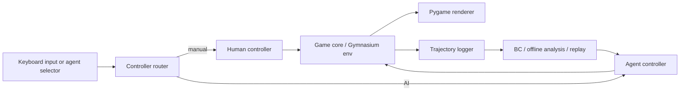
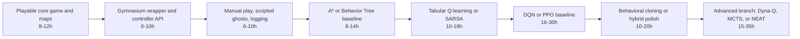

# ML Algorithms for a Playable Pac-Man Project with Selectable AI Agents

## Executive summary

For a solo developer building a Pac-Man project that supports both manual play and switchable AI control, the highest-return strategy is to separate **gameplay architecture** from **agent architecture** from the start: build one game core, expose it through a Gymnasium-compatible `step/reset/render` interface, and let both the keyboard controller and AI controllers call the same action API. That design makes it straightforward to move from manual play, to scripted/search agents, to imitation learning, to reinforcement learning without rewriting the game itself. The official Gymnasium environment contract, Stable Baselines3 custom-environment guidance, and Pygame’s event-loop model all align well with this design. citeturn13view6turn24view2turn16view5

For Pac-Man specifically, **classical search/planning and rule-based control** are the fastest route to a competent playable agent; **tabular RL** is the best first learning-based step on engineered features; and **deep RL** becomes worthwhile only after the environment, observations, rewards, and evaluation protocol are stable. In practice, A* and behavior-tree-driven agents give immediate playability, Q-learning and SARSA are ideal entry-level learning baselines on compact state abstractions, and Double/Dueling DQN or PPO are the most practical “serious” learning agents for discrete-action Pac-Man. \u200bSAC is powerful in continuous control, but mainstream implementations such as Stable Baselines3’s SAC target continuous `Box` action spaces rather than standard discrete Pac-Man actions. citeturn20view2turn20view3turn14view1turn18view1turn18view2turn15view2turn15view1

If your goal is a **project that is fun to play, easy to demo, and extensible**, the best staged path is:  
manual play → heuristic/search baseline → tabular RL → deep RL or behavioral cloning → hybrid controller. That path climbs smoothly from entry-level to advanced methods while keeping the game continuously playable. The official Pacman assignments from classic AI coursework, the Atari benchmark environment for entity["video_game","Ms. Pac-Man","atari 2600"], and modern RL tooling all support this progression well. citeturn20view2turn14view7turn28view2turn13view4

## Pac-Man as an ML environment

Pac-Man sits at the intersection of **grid navigation, stochastic adversaries, sparse long-horizon rewards, and real-time action constraints**. That makes it unusually good for demonstrating a spectrum of AI methods. A custom clone gives full control over reward design, ghost logic, layouts, and rendering. A benchmark-style variant can be built on the official ALE environment, where `gymnasium.make("ALE/MsPacman-v5")` exposes a `Discrete(9)` action space and pixel or RAM observations. The maintained RL/environment stack today is Gymnasium; the legacy Gym documentation explicitly notes that Gym has been unmaintained since 2022 and that Gymnasium is the maintained drop-in replacement. citeturn14view7turn16view4turn28view1turn13view7

A practical implementation stack is: **Pygame** for the human game loop and rendering, **Gymnasium** for the agent-facing environment API, **ALE** if you want Atari-compatible benchmarking, **Stable Baselines3** for reliable baseline RL implementations, **PyTorch** or **TF-Agents** when you need custom DQN-family variants, **imitation** for behavioral cloning and related methods, **DEAP** or NEAT-Python for evolutionary search, and **PettingZoo** if you later decide to train both Pac-Man and ghosts as a multi-agent system. The official docs for these tools are mature and interoperable enough for a solo build. citeturn16view5turn13view6turn28view2turn16view6turn16view7turn16view8turn19view2turn19view3turn9search1

The key modeling decision is **what the agent observes**. Search methods and tabular RL work best on compact, engineered state descriptions. Deep RL works best on pixels, frame stacks, or rich dict observations. Stable Baselines3’s DQN, A2C, and PPO all support dedicated image policies and multi-input policies for dict observations, while Gymnasium’s wrappers support Atari preprocessing and frame stacking. citeturn14view1turn15view0turn15view2turn16view0turn16view1turn16view2turn24view2

| Representation | Typical contents | Best-fit algorithms | Main advantage | Main limitation |
|---|---|---|---|---|
| Compact grid tuple | `(x, y, dir, nearest_pellet_dist, nearest_ghost_dist, frightened_timer, pellets_left, legal_moves_mask)` | Q-learning, SARSA, decision trees, SVM, k-NN | Fast to train and easy to debug | May throw away important structure |
| Junction/topology features | Current node, shortest-path distances to food/power pellets/ghosts, dead-end flags, escape-route counts | A*, minimax/expectimax, MCTS, PPO-MLP | Encodes strategy more directly than raw pixels | Requires hand-engineering |
| Dict observation | Separate arrays for agent, ghosts, pellets, power pellets, timers, legal actions | DQN `MultiInputPolicy`, A2C/PPO `MultiInputPolicy` | Flexible and interpretable | More design work than pixels |
| Pixel stack | Grayscale or RGB frames, often 4 stacked frames | DQN family, PPO/A2C CNNs | Minimal feature engineering | Expensive and sample-hungry |
| RAM / emulator state | Fixed-length low-level emulator variables, such as ALE RAM | Fast Atari baselines, research experiments | Smaller than pixels | Less interpretable than engineered features |

For actions, a custom clone should usually expose `Discrete(4)` or `Discrete(5)`—up, down, left, right, and optionally no-op—while an Atari-compatible agent can use ALE’s built-in `Discrete(9)` action set, which includes diagonal directions and no-op. Internally, it is worth normalizing all controllers to one project-level action enum and then writing small adapters for custom gameplay or ALE benchmarking. citeturn13view7turn24view2turn14view7

Reward design matters more in Pac-Man than in many toy RL tasks because the natural score signal is sparse and delayed. A good default is to keep the **true game score** as the core task reward and add modest shaping terms only when they accelerate learning without changing the intended objective: pellet eaten, power pellet eaten, ghost eaten while frightened, level cleared, life lost, repeated-wall bumps, dithering, or movement toward a strategically valuable target. The classic reward-shaping literature is clear that shaping can speed learning, but naive shaping can also create pathological behavior; potential-based shaping is the standard safe pattern because it preserves the optimal policy under the original objective. During evaluation, shaped and unshaped metrics should be reported separately, because reward-modifying wrappers affect episode returns and lengths unless the evaluation environment is wrapped carefully. citeturn24view0turn24view1turn13view5

## Algorithm families and Pac-Man suitability

### Supervised learning and imitation

The classical supervised-learning family—**decision trees, random forests, SVMs, and k-NN**—is best viewed as a way to learn a **reflex policy** from labeled state-action pairs. Decision trees are simple, interpretable, and require little data preparation; scikit-learn notes that prediction cost is logarithmic in the number of training points, but trees can overfit, become unstable under small data variations, and do not extrapolate well. Random forests reduce that instability by averaging many trees, which improves predictive accuracy and helps control overfitting. SVMs are effective in high-dimensional spaces and when features outnumber samples, but calibrated probabilities are expensive and the method is less convenient for frequent online retraining. k-NN is simple and often strong on irregular decision boundaries, but it is a non-generalizing method that effectively memorizes the dataset and pushes more work into inference. For Pac-Man, these methods are strongest when you already have a sensible feature vector and just want a learned **instantaneous move selector** rather than deep long-horizon planning. citeturn29view1turn13view1turn13view2turn13view3

In practical Pac-Man terms, that means they work well for policies like “run toward the best safe pellet corridor,” “chase frightened ghosts,” or “avoid threat zones,” provided those ideas have already been encoded into features. Their advantages are fast prototyping, orderly debugging, and low compute cost. Their limits are strategic: they do not naturally reason over future states unless you explicitly feed them search-derived features such as lookahead values or shortest-path distances. They are therefore best used as **entry-level learned baselines** or as policy heads inside a larger hybrid system. citeturn29view1turn13view1turn13view2turn13view3

**Behavioral cloning** is the simplest imitation-learning route. The official `imitation` docs define BC as supervised learning on observation-action pairs from expert demonstrations and warn that it often generalizes poorly and does not recover well from errors. That warning is especially relevant in Pac-Man, where one bad turn can move the agent into a dead end or ghost trap that never appeared in the demonstration data. BC is still extremely useful here because your project already includes **manual play**: the human controller can become a data generator. A second strong option is to use a scripted expert—say, a behavior tree or A* planner—to generate higher-volume demonstrations than a human could. BC then becomes an excellent way to get a “human-like” or “expert-like” selectable AI quickly, after which RL fine-tuning can improve recovery and long-horizon behavior. The same library also exposes DAgger, GAIL, and AIRL if pure BC plateaus. citeturn16view8turn16view9

For training data, supervised reflex models on engineered features can start becoming useful with a few thousand labeled decisions, while pixel-based cloning usually needs much more coverage because the input space is vastly larger. In solo-project terms, classical supervised models usually cost **minutes**, BC on small MLPs or compact CNNs usually costs **minutes to a few hours**, and the dominant cost is usually not optimization but collecting demonstrations with enough coverage of ghost encounters, power-pellet timing, and corner cases. That estimate is an engineering judgment supported by the relative simplicity of the classical methods and the `imitation` library’s demonstration-centric design. citeturn29view1turn16view9turn16view8

### Classical search, planning, and rule-based control

If the goal is to make Pac-Man **play well quickly**, classical search and rule-based control have the best return on effort. A* is the obvious first tool because Pac-Man is full of shortest-path subproblems: moving to the nearest pellet, to a power pellet, to a safe junction, or away from a ghost through a low-risk corridor. The original A* paper established its optimality properties under admissible heuristics, and the standard Pacman project sequence explicitly uses A* in the Pacman world. In practice, A* gives you strong local tactical motion with zero training cost. citeturn3search16turn20view2

**Minimax with heuristics** becomes relevant when you model the ghosts as adversaries. The Berkeley Pacman materials treat classic Pacman as a multi-agent search problem and pair minimax with evaluation functions and alpha-beta pruning. Alpha-beta can reduce runtime to as good as \(O(b^{m/2})\) in the best case and effectively increases useful search depth; evaluation functions are commonly built as weighted combinations of state features. For Pac-Man clones with deterministic or near-deterministic ghosts, minimax gives a clean way to trade off food-seeking against ghost avoidance. Its drawback is that it can be too pessimistic when ghosts are partly stochastic or scripted rather than adversarial. citeturn20view3turn20view4

That is why **expectimax** is often a better conceptual fit than minimax for the classic Pac-Man feel. Berkeley’s lecture material explicitly frames random or unpredictable ghosts as a setting where values should reflect average-case outcomes rather than worst-case outcomes. If your ghosts have randomized move selection, probabilistic scatter/chase behavior, or noisy action outcomes, expectimax is usually the right classical baseline. In other words, minimax is best when you want “worst-case survival,” expectimax when you want “best play against stochastic ghosts.” citeturn20view3turn20view5

**Monte Carlo Tree Search** sits between fixed-depth search and learned RL. The core survey describes MCTS as combining the precision of tree search with the generality of random sampling, and the original UCT work frames it as a bandit-guided planning algorithm for large state spaces. For Pac-Man, MCTS is attractive when you have a reasonably fast forward simulator and want the agent to evaluate many possible short futures under ghost randomness without hand-deriving an exact evaluation function. Its limitations are predictable: rollout budgets become the main compute knob, and real-time play depends heavily on how many simulations per move your Python implementation can sustain. citeturn22view0turn7search0

**Behavior Trees** are not “learning algorithms” in the narrow sense, but they are extremely well suited to a playable Pac-Man project because they are hierarchical, modular, and reactive. The official BehaviorTree.CPP docs define them as a way to structure switching between tasks in an autonomous agent and emphasize their modularity and reactivity. For Pac-Man, that translates naturally into trees such as: “if frightened ghost is reachable, chase; else if nearby threat is high, flee to safe junction; else pursue pellet plan.” The crucial point is that BTs let you **compose** A*, heuristics, rule checks, and learned subpolicies in one controller that still behaves robustly in real time. citeturn20view6

From a project-planning perspective, this family should be your first serious baseline. There is no data collection phase, very little hyperparameter fragility, and per-move inference can stay easily within real-time budgets if you keep horizons shallow or cache shortest paths. For a game demo, that matters enormously. citeturn20view2turn20view3turn20view6

### Model-free reinforcement learning

**Tabular Q-learning** is the cleanest first RL algorithm for Pac-Man if you use a compact state abstraction. Sutton and Barto describe Q-learning as an off-policy TD control algorithm, and Watkins and Dayan proved its convergence to optimal action-values under the standard discrete repeated-sampling assumptions. In a custom Pac-Man clone, it is a strong first learning agent when the state is something like “current tile + nearest ghost threat + food direction + frightened flag + legal moves.” Its main limitation is combinatorial state growth: the more layout, ghost, timer, and history detail you include, the less practical pure tables become. citeturn27view2turn25search3

**SARSA** is the natural companion baseline. Sutton and Barto’s treatment makes explicit that one-step SARSA is on-policy, estimating the action values of the behavior policy currently being executed. In their classic cliff-walking example, Q-learning learns the optimal but risky cliff-edge route under ε-greedy exploration, whereas SARSA learns the longer but safer route because it accounts for the exploratory policy itself. That distinction maps very cleanly to Pac-Man: if your agent will continue taking exploratory actions during training or even during casual play, SARSA often produces a less brittle, more survival-oriented policy than Q-learning. citeturn27view1turn27view2

Once you move beyond compact feature abstractions, **DQN** is the natural deep-RL baseline because Pac-Man has discrete actions. Stable Baselines3’s DQN documentation emphasizes the three stabilizing ingredients that made DQN viable with neural networks: replay buffer, target network, and gradient clipping. The original DQN results showed that a single convolutional architecture could learn directly from high-dimensional sensory inputs across Atari games. For a custom Pac-Man clone, DQN is most justified when you want either pixel input or richer dict observations that would otherwise be awkward in tabular form. citeturn14view1turn18view0turn11search2

Two DQN extensions are especially relevant. **Double DQN** addresses the overestimation problem in standard DQN, which is important in games with a few apparently high-value but actually dangerous action branches near ghosts. **Dueling DQN** separates state value from action advantage, which is especially useful when many actions in a given state have similar consequences or when “being in the right place” matters more than tiny differences among moves. Pac-Man often has exactly that structure: at some states, only one or two moves matter, while at others many moves are roughly equivalent and the state itself is what carries strategic value. Stable Baselines3’s built-in DQN is intentionally vanilla and does not include Double or Dueling variants, so if those are your target algorithms you will usually implement them directly in PyTorch or TensorFlow/TF-Agents. citeturn18view1turn18view2turn14view1turn16view6turn16view7

For actor-critic methods, **A3C** is historically important because the original paper showed that parallel actor-learners stabilize deep RL training. **A2C** is the synchronous practical variant and Stable Baselines3 explicitly describes it that way. **PPO** is the most generally recommendable actor-critic baseline for this project because the PPO paper itself argues that it strikes a favourable balance among sample complexity, simplicity, and wall-time, while the SB3 docs emphasize its robust clipped updates and support for discrete actions and multiprocessing. On a Pac-Man project, PPO is often easier to make productive than a custom DQN stack if your observations are already compact or dict-structured rather than raw Atari pixels. It is usually my top recommendation for an intermediate-to-advanced learning agent after tabular RL. citeturn18view3turn15view0turn18view4turn15view2

**SAC** deserves a careful caveat. The SAC paper is compelling because it argues for improved exploration, robustness, and sample efficiency through off-policy maximum-entropy learning. However, the standard SB3 SAC implementation expects a continuous `Box` action space, and the SB3 algorithm table confirms that SAC is not implemented there for discrete actions. So although SAC is a major RL algorithm and absolutely belongs in a research survey, it is **not** the first-line choice for a standard Pac-Man controller unless you purposely reformulate the action interface or use a separate discrete-SAC implementation. For most Pac-Man builds, PPO or DQN-family methods are much more natural. citeturn18view5turn15view1turn14view0

### Model-based, evolutionary, and hybrid methods

The canonical entry point for **model-based RL** in a Pac-Man-like setting is **Dyna-Q**. Sutton’s Dyna work is explicit: Dyna architectures integrate trial-and-error reinforcement learning, online world-model learning, and execution-time planning in one process. The broader model-based RL survey frames the family as learning dynamics and then integrating planning with learning and acting. For a custom Pac-Man clone with deterministic maze geometry and relatively simple ghost rules, a lightweight learned or scripted forward model can be disproportionately valuable because it lets you reuse data for both direct learning and simulated planning. This is one of the most intellectually satisfying directions once you already have a decent model-free baseline. citeturn20view0turn21view0

That said, model-based RL has a real engineering tax. You must choose what the model predicts, how far ahead to roll it, how to handle ghost stochasticity, and how to keep model error from dominating planning. For a benchmark or portfolio project, the simplest model-based Pac-Man path is not a full latent world model; it is usually **Dyna-Q on engineered discrete states** or a hand-coded simulator paired with MCTS. Those are advanced enough to be interesting but still tractable for one developer. citeturn20view0turn21view0turn24view1

**Evolutionary methods** are conceptually attractive because they avoid gradient design and can optimize policies, heuristics, or controller parameters directly by episode return. Sutton and Barto classify genetic algorithms and related approaches as evolutionary methods and point out that they can be effective when the policy space is manageable or when the agent does not accurately sense state, but they also emphasize that such methods often ignore structure in the state–action interaction and can therefore be less efficient than RL. In Pac-Man, plain genetic algorithms are most useful for **tuning heuristic or behavior-tree weights** rather than for replacing RL entirely. DEAP is an excellent official framework for rapid prototyping here, and PyGAD is another easy Python option. citeturn26view0turn19view2turn17search1

**NEAT** occupies a more interesting niche than plain GA because it evolves both weights and topology. The original NEAT paper argues that its efficiency comes from principled crossover of different topologies, protection of structural innovation via speciation, and incremental growth from minimal structure; the NEAT-Python docs make it straightforward to prototype these ideas in Python. For Pac-Man, NEAT is best used when you want an experimental, visually interesting agent on engineered features or partial observations, and when you are willing to pay for many episode evaluations. It is farther from the shortest path to a polished playable project than A*, tabular RL, DQN, or PPO—but it is a strong “advanced branch” once the rest of the project already works. citeturn19view0turn19view3

The most useful practical category is really **hybrid approaches**. Pac-Man heavily rewards controller stacks like: behavior tree for high-level mode switching, A* for local pathing, heuristic safety checks for ghost proximity, and a learned policy only for ambiguous local decisions. Another excellent hybrid is **behavioral cloning to warm-start a policy, then RL fine-tuning**. A third is **Dyna-Q**, which is hybrid by construction. In a playable project, hybrids often outperform purist solutions because they preserve game feel, reduce catastrophic errors, and keep the system explainable. citeturn20view6turn16view9turn20view0turn21view0

## Comparison and practical budgets

The comparison table below is a **Pac-Man-specific engineering synthesis** rather than a benchmark ranking. The complexity, sample-efficiency, and performance-ceiling judgments are based on the official algorithm docs and primary papers for scikit-learn, the Berkeley Pacman materials, the DQN/PPO/A3C/SAC/NEAT literature, the model-based RL survey, and the imitation and DEAP/NEAT-Python documentation. citeturn29view1turn13view1turn13view2turn13view3turn20view2turn20view3turn22view0turn27view2turn14view1turn18view1turn18view2turn15view2turn15view0turn15view1turn20view0turn21view0turn16view9turn19view0turn19view2

| Algorithm | Complexity | Sample efficiency | Compute needs | Performance potential | Ease of implementation | Suitability for real-time play |
|---|---|---:|---:|---:|---:|---:|
| Decision Tree | Low | High if labels exist | Low | Low–Medium | Easy | Excellent |
| Random Forest | Low–Medium | High if labels exist | Low | Medium | Easy | Excellent |
| SVM | Medium | Medium–High on good features | Medium | Medium | Moderate | Good |
| k-NN | Low | Medium on small datasets | Low training / higher inference | Low–Medium | Easy | Good on small datasets |
| Behavioral Cloning | Medium | High if demos are strong | Low–Medium | Medium | Moderate | Excellent after training |
| A* | Medium | N/A | Low per move | Medium–High | Moderate | Excellent |
| Minimax / Expectimax | Medium–High | N/A | Medium–High per move | Medium–High | Moderate | Fair–Good with shallow depth |
| MCTS | High | N/A | Tunable to high | High | Hard | Fair–Good if simulator is fast |
| Behavior Trees | Low–Medium | N/A | Low | Medium–High in hybrid form | Moderate | Excellent |
| Tabular Q-learning | Low | Medium on compact states | Low | Medium | Easy | Excellent after training |
| SARSA | Low | Medium on compact states | Low | Medium | Easy | Excellent after training |
| DQN | Medium | Medium | Medium–High | High | Moderate | Excellent after training |
| Double DQN | Medium–High | Medium | Medium–High | High | Moderate | Excellent after training |
| Dueling DQN | Medium–High | Medium | Medium–High | High | Moderate | Excellent after training |
| A2C / A3C | Medium | Low–Medium | Medium | Medium–High | Moderate | Excellent after training |
| PPO | Medium | Low–Medium | Medium | High | Moderate | Excellent after training |
| SAC | Medium–High | High in continuous control, poor fit here | Medium–High | Low for standard discrete Pac-Man unless reformulated | Hard | Poor–Fair for this problem shape |
| Dyna-Q | Medium–High | High on compact discrete states | Medium | High | Hard | Good–Excellent |
| Genetic Algorithm | Medium | Low | Medium–High | Medium | Moderate | Excellent after offline tuning |
| NEAT | High | Low–Medium | High | Medium–High | Hard | Excellent after evolution |
| Hybrid BT + search + learning | High | Usually best overall trade-off | Medium | Very high | Hard | Excellent |

For a solo project, it is also useful to think in terms of **practical budgets** rather than just asymptotic properties. The ranges below are engineering estimates, not universal benchmark guarantees. Vectorized environments can provide near-linear step-throughput gains, SB3 recommends CPU-friendly vectorization for A2C/PPO, BC depends on demonstration volume, DQN/PPO-style deep RL generally needs much larger training budgets than tabular RL, and NEAT-style evolution pays primarily in repeated episode evaluation rather than backpropagation. citeturn16view3turn15view0turn15view2turn16view9turn18view0turn18view4turn19view0

| Approach family | Training data need | Practical training budget | Typical wall-clock for a solo dev |
|---|---|---|---|
| Search / behavior tree | None | No learning; tune heuristics manually | Immediate to same day |
| Classical supervised | 2k–20k labeled decisions on engineered features | Train on CPU | Minutes to a few hours |
| Behavioral cloning | 5k–100k+ demonstrations, depending on observation richness | Offline supervised training | Hours to a day including demo collection |
| Tabular Q-learning / SARSA | Compact state abstraction; online data | ~10k–500k episodes | Minutes to several hours |
| DQN family | Online interaction; replay buffer | ~0.5M–5M env steps is a reasonable project-scale starting range | Several hours to a few days |
| PPO / A2C | Online interaction; vector envs help a lot | ~1M–10M env steps depending observation richness | Several hours to a few days |
| Dyna-Q / model-based discrete | Online interaction plus model/planning updates | Smaller than deep model-free when the model is accurate | Hours to a day plus extra implementation time |
| Genetic algorithms / NEAT | No gradient data; many episode evaluations | 50–500 generations × population 32–256 is a common practical scale | Hours to multiple days |

The important meta-point is that **real-time inference is not the hard part** for most trained agents. The hard parts are environment correctness, reward design, data coverage, and evaluation discipline. Search agents and trained neural agents alike can usually act in real time; the difference is how much work it takes to get them there. citeturn13view6turn16view5turn28view2

## Evaluation and control integration

A Pac-Man AI should be evaluated on **three layers of performance at once**. The first is **game performance**: score, pellets cleared, level-completion rate, survival time, deaths per episode, frightened-ghost capture count, and action latency. The second is **learning performance**: mean episodic return, standard deviation across seeds, score-vs-steps sample-efficiency curves, and generalization to held-out layouts or altered ghost policies. The third is **system correctness**: legal-action rate, collision correctness, wrapper correctness, and consistency between shaped and unshaped reward reporting. Stable Baselines3’s evaluation docs are explicit that wrappers can bias measured rewards and episode lengths unless evaluation environments are wrapped carefully. citeturn13view5turn13view4turn24view2

A sensible testing protocol is: keep a fixed **training layout set**, a smaller **validation set** for reward/feature tuning, and a **held-out test set** with different maze geometries, pellet densities, or ghost seeds; evaluate each controller over multiple seeds; report both deterministic and stochastic inference where applicable; and run ablations on observation design, reward shaping, frame stacking, and exploration schedule. If you use deep RL, follow SB3’s own advice and keep a separate test environment, check wrappers explicitly, and use quantitative rather than anecdotal evaluation. citeturn13view4turn13view5

The best controller architecture for “manual or AI at runtime” is shown below. It follows directly from the Gymnasium/Pygame separation of environment stepping and rendering and adds one critical game-dev feature: **trajectory logging** from both human and AI play. Those logs become training data for behavioral cloning or offline debugging. citeturn13view6turn16view5turn16view9

In practice, five integration rules matter most. First, define a single `Controller` interface such as `select_action(game_state) -> action`, and make both human and AI controllers implement it. Second, ensure the **same legality checks and movement rules** are used for manual and AI moves, so controller switching does not change gameplay semantics. Third, swap controllers only at safe synchronization points—typically episode boundaries or tile centers—to avoid awkward partial-frame action changes. Fourth, log trajectories from every controller, including human play, scripted search play, and learned play. Fifth, evaluate score with deterministic inference for headline comparisons, but keep stochastic evaluation for robustness checks. These are engineering rules rather than textbook theorems, but they follow naturally from the official environment interfaces and evaluation guidance. citeturn13view6turn16view5turn13view5turn24view2

A particularly useful implementation detail is to keep **rendering decoupled from training**. The game core should be able to run with `render_mode=None` for training and `render_mode="human"` for play and demos. Gymnasium explicitly supports separate rendering modes, and Pygame’s loop makes it easy to keep a stable frame cap for human play while running headless during training. citeturn13view6turn16view5

## Roadmap and learning resources

The cleanest set of **entry-level to advanced implementation paths** is:

- **Entry-level path:** manual play + scripted ghosts + A* / behavior tree agent.  
- **Beginner RL path:** compact engineered state + tabular SARSA or Q-learning.  
- **Intermediate path:** dict observation + PPO or vanilla DQN.  
- **Advanced deep-RL path:** Double/Dueling DQN or PPO with frame stacking and richer observations.  
- **Research path:** BC from human/scripted play, then RL fine-tune; or Dyna-Q / MCTS / NEAT as an advanced branch. citeturn20view2turn20view3turn27view1turn27view2turn14view1turn18view1turn18view2turn15view2turn20view0turn19view0turn16view9

The roadmap below is a practical solo-developer sequence. The **hours are engineering estimates**, not literature values, and they assume you are building a polished but not research-grade codebase.

| Milestone | Main deliverable | Estimated effort |
|---|---|---:|
| Core game shell | Maze loading, pellets, power pellets, collisions, score, ghosts, win/loss loop | 8–12 h |
| Environment abstraction | Gymnasium-compatible `step/reset/render/close`, action/observation spaces, headless mode | 6–10 h |
| Human/controller layer | Keyboard control, selectable agent menu, trajectory logging, replay format | 6–10 h |
| First competent AI | A*, reflex heuristics, or behavior tree baseline | 8–14 h |
| First learning agent | Engineered features plus tabular Q-learning or SARSA | 10–18 h |
| Deep learning baseline | PPO or DQN-family agent, evaluation harness, seed sweeps | 16–30 h |
| Data-driven polish | Behavioral cloning from human or scripted expert; optional RL fine-tune | 10–20 h |
| Advanced extension | Dyna-Q, MCTS with learned evaluator, or NEAT branch | 15–35 h |

A good stopping rule is this: do **not** move to the next family until the previous one is both **playable** and **benchmarkable**. If your A* or BT agent is not stable, deep RL will mostly amplify bugs. If your reward accounting is wrong, imitation and RL will optimize the wrong thing. If your evaluation harness is weak, “better” agents will be mostly anecdotal. citeturn13view4turn13view5turn24view2

For learning resources, prioritize primary and official material in roughly this order:

- **entity["book","Reinforcement Learning: An Introduction","sutton barto"]** for the conceptual foundation behind Q-learning, SARSA, value functions, planning, model-based methods, and the relationship between RL and evolutionary methods. citeturn7search10turn26view0
- The Pacman assignments and textbook material from entity["organization","University of California, Berkeley","public university"] for A*, minimax, expectimax, evaluation functions, and approximate-Q-learning style ideas in an actual Pacman setting. citeturn20view2turn20view3turn20view4turn20view5
- The Gymnasium and ALE documentation from the entity["organization","Farama Foundation","rl standards org"] for custom environments, wrappers, Atari preprocessing, frame stacking, vector environments, and the official `ALE/MsPacman-v5` setup. citeturn13view7turn13view6turn16view0turn16view1turn16view2turn16view3turn16view4turn14view7
- Stable Baselines3 for practical baseline implementations, RL tips, callbacks, evaluation helpers, Atari examples, and custom-environment guidance. citeturn28view2turn13view4turn13view5turn24view2turn14view5
- The official PyTorch DQN tutorial and the official TF-Agents DQN tutorial for custom deep-RL implementation patterns beyond baseline libraries. citeturn16view6turn16view7
- The PPO and SAC educational material from entity["organization","OpenAI","AI research lab"], especially if you want conceptual clarity before implementing or modifying actor-critic methods. citeturn18view4turn17search3turn17search7
- The `imitation` library docs for behavioral cloning, DAgger, GAIL, AIRL, and demonstration handling. citeturn16view8turn16view9
- NEAT-Python and DEAP documentation for evolutionary branches or heuristic-weight search. citeturn19view3turn19view2
- Pygame’s quick-start docs for a clean event loop, timing, and rendering foundation. citeturn16view5

If I had to recommend one **default plan** for a portfolio-quality build, it would be this:  
**Pygame + Gymnasium core → manual play + logging → A* / BT agent → tabular SARSA → PPO or Double/Dueling DQN → BC or hybrid polish.** That path covers the full range from entry-level to advanced, keeps the game playable at every stage, and produces a codebase that is both demo-friendly and technically credible. citeturn16view5turn13view6turn20view2turn20view3turn27view1turn15view2turn18view1turn18view2turn16view9